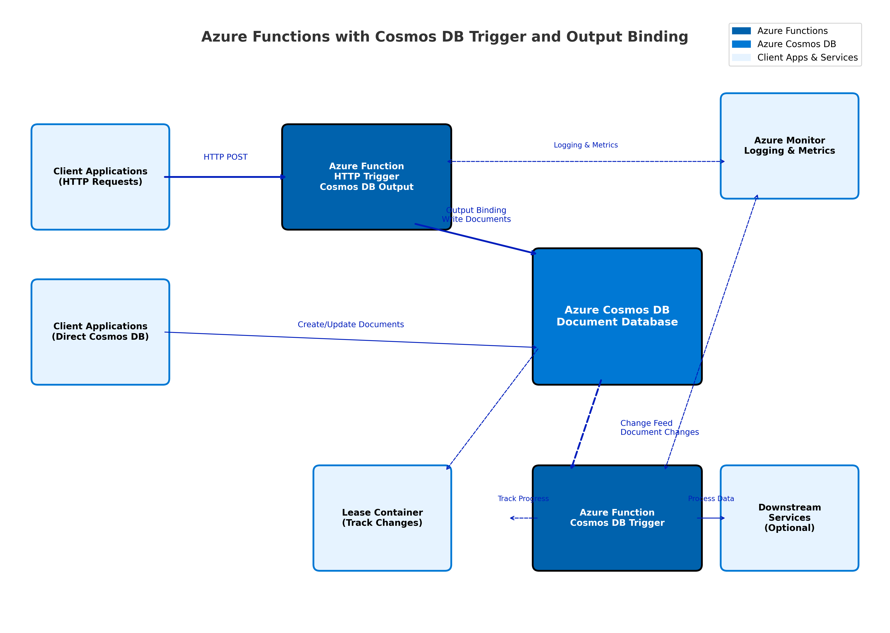

<!--
---
name: Azure Functions Python CosmosDb Trigger using Azure Developer CLI
description: This repository contains an Azure Functions CosmosDb trigger quickstart written in Python and deployed to Azure Functions Flex Consumption using the Azure Developer CLI (azd). The sample uses managed identity and a virtual network to make sure deployment is secure by default.
page_type: sample
products:
- azure-functions
- azure-cosmos-db
- azure
- entra-id
urlFragment: starter-cosmosdb-trigger-python
languages:
- python
- bicep
- azdeveloper
---
-->

# Azure Functions with Cosmos DB Trigger and Output Binding (Python)

An Azure Functions QuickStart project that demonstrates how to use both Cosmos DB Triggers and Cosmos DB Output Bindings with Azure Developer CLI (azd) for rapid, event-driven integration and data ingestion with Azure Cosmos DB using Python 3.11 or higher.

## Architecture



This architecture shows how Azure Functions can both write to and react to changes in Cosmos DB using output bindings and triggers. The key components include:

- **Client Applications**: Send HTTP requests to the Azure Function or create/update documents directly in Cosmos DB
- **Azure Function with Cosmos DB Output Binding**: Receives HTTP requests and writes data to Cosmos DB
- **Azure Function with Cosmos DB Trigger**: Executes automatically when changes are detected  
- **Azure Cosmos DB**: Stores documents and provides change feed capabilities
- **Change Feed**: Detects modifications to documents in Cosmos DB
- **Lease Container**: Tracks which changes have been processed to ensure reliability and support for multiple function instances
- **Azure Monitor**: Provides logging and metrics for the function execution
- **Downstream Services**: Optional integration with other services that receive processed data

This serverless architecture enables scalable, event-driven data ingestion and processing with built-in resiliency.

## Top Use Cases

### Cosmos DB Output Binding
1. **Data Ingestion API**: Quickly create APIs that write data to Cosmos DB without custom data access code. Perfect for building serverless endpoints that accept HTTP requests and store documents.

### Cosmos DB Trigger  
2. **Real-time Data Processing Pipeline**: Automatically process data as it's created or modified in your Cosmos DB. Perfect for scenarios where you need to enrich documents, update analytics, or trigger notifications when new data arrives without polling.
3. **Event-Driven Microservices**: Build event-driven architectures where changes to your Cosmos DB documents automatically trigger downstream business logic. Ideal for order processing systems, inventory management, or content moderation workflows.

## Features

* Cosmos DB Trigger
* Cosmos DB Output Binding
* Azure Functions Flex Consumption plan
* Azure Developer CLI (azd) integration for easy deployment
* Infrastructure as Code using Bicep templates
* Python 3.11+ support

## Getting Started

### Prerequisites

- [Python 3.11+](https://www.python.org/downloads/)
- [Azure Functions Core Tools](https://docs.microsoft.com/azure/azure-functions/functions-run-local#install-the-azure-functions-core-tools)
- [Azure Developer CLI (azd)](https://docs.microsoft.com/azure/developer/azure-developer-cli/install-azd)
- [Azurite](https://github.com/Azure/Azurite)
- An Azure subscription

### Quickstart

1. Clone this repository
   ```bash
   git clone https://github.com/Azure-Samples/functions-quickstart-python-azd-cosmosdb.git
   cd functions-quickstart-python-azd-cosmosdb
   ```

2. Make scripts executable (Mac/Linux):
   ```bash
   chmod +x ./infra/scripts/*.sh
   ```
   On Windows:
   ```powershell
   set-executionpolicy remotesigned
   ```

3. Provision Azure resources using azd
   ```bash
   azd provision
   ```
   This will create all necessary Azure resources including:
   - Azure Cosmos DB account
   - Azure Function App
   - App Service Plan
   - Other supporting resources
   - `local.settings.json` for local development with Azure Functions Core Tools, which should look like this:
   ```json
   {
     "IsEncrypted": false,
     "Values": {
       "AzureWebJobsStorage": "UseDevelopmentStorage=true",
       "FUNCTIONS_WORKER_RUNTIME": "python",
       "COSMOS_CONNECTION__accountEndpoint": "https://{accountName}.documents.azure.com:443/",
       "COSMOS_DATABASE_NAME": "documents-db",
       "COSMOS_CONTAINER_NAME": "documents"
     }
   }
   ```

   The `azd` command automatically sets up the required connection strings and application settings.

4. (Optional) Create and activate a Python virtual environment:
   ```bash
   python3 -m venv .venv
   source .venv/bin/activate  # On Windows use: .venv\Scripts\activate
   ```

5. Install Python dependencies:
   ```bash
   pip install -r requirements.txt
   ```

6. Start the function locally
   ```bash
   func start
   ```
   Or use VS Code to run the project with the built-in Azure Functions extension by pressing F5.

7. Test the functions locally

   **Testing the HTTP trigger with Cosmos DB output binding:**
   Send a POST request to the HTTP endpoint:
   ```json
   {
     "id": "doc-001",
     "Text": "This is a sample document",
     "Number": 42,
     "Boolean": true
   }
   ```
   You can use tools like curl, Postman, or httpie:
   ```bash
   curl -X POST http://localhost:7071/api/httptriggercosmosdboutput \
     -H "Content-Type: application/json" \
     -d '{"id":"doc-001","Text":"This is a sample document","Number":42,"Boolean":true}'
   ```
   The function will write the document to Cosmos DB and return the created object.

   **Testing the Cosmos DB trigger:**
   You can also create a document directly in your Cosmos DB container using Azure Portal or Azure CLI:
   ```json
   {
     "id": "doc-002",
     "Text": "This is another sample document",
     "Number": 84,
     "Boolean": false
   }
   ```

   When documents are created or modified (either via HTTP or directly), the Cosmos DB trigger function will execute automatically. You should see console output like:
   ```
   Documents modified: 1
   First document: { ... }
   First document id: doc-001
   ```

8. Deploy to Azure
   ```bash
   azd up
   ```
   This will build your function app and deploy it to Azure. The deployment process:
   - Checks for any bicep changes using `azd provision`
   - Packages the Python project
   - Publishes the function app using `azd deploy`
   - Updates application settings in Azure

   > **Note:** If you deploy with `vnetEnabled=true`, see the [Networking and VNet Integration](#networking-and-vnet-integration) section below for important details about accessing Cosmos DB and Data Explorer from your developer machine.

9. Test the deployed functions by using both the HTTP endpoint and by adding documents directly to Cosmos DB:
   
   **Testing the HTTP endpoint:**
   Send a POST request to your deployed Azure Function endpoint (see Azure Portal for the URL):
   ```bash
   curl -X POST https://your-function-app.azurewebsites.net/api/httptriggercosmosdboutput \
     -H "Content-Type: application/json" \
     -d '{"id":"doc-003","Text":"Deployed function test","Number":123,"Boolean":true}'
   ```

   **Testing the trigger:**
   - Navigate to your Cosmos DB account in the Azure Portal
   - Go to Data Explorer
   - Find your database and container
   - Create a new document with similar structure to the test document above
   - Check your function logs in the Azure Portal to verify the trigger worked

## Understanding the Functions

This sample includes two Azure Functions that demonstrate different Cosmos DB integration patterns:

1. **HTTP Trigger with Cosmos DB Output Binding**: Accepts HTTP requests and writes data to Cosmos DB
2. **Cosmos DB Trigger**: Reacts to changes in Cosmos DB documents using the change feed

The key environment variables that configure their behavior are:

- `COSMOS_CONNECTION__accountEndpoint`: The Cosmos DB account endpoint
- `COSMOS_DATABASE_NAME`: The name of the database to monitor/write to
- `COSMOS_CONTAINER_NAME`: The name of the container to monitor/write to

These are automatically set up by azd during deployment for both local and cloud environments.

### HTTP Trigger with Cosmos DB Output Binding Function

This function receives HTTP POST requests and writes the payload to Cosmos DB using the output binding:

```python
@app.function_name("httptrigger-cosmosdb-output")
@app.route(route="httptriggercosmosdboutput", methods=["POST"])
@app.cosmos_db_output(arg_name="doc",
                      database_name=os.environ.get("COSMOS_DATABASE_NAME"),
                      container_name=os.environ.get("COSMOS_CONTAINER_NAME"),
                      connection="COSMOS_CONNECTION")
def http_trigger_cosmosdb_output(req: func.HttpRequest, doc: func.Out[func.Document]) -> func.HttpResponse:
    """HTTP trigger with Cosmos DB output binding to insert documents."""
    # Parse the request body
    req_body = req.get_json()
    
    # Create a new Document and set it to the output binding
    doc.set(func.Document.from_dict(req_body))
    
    # Return success response
    return func.HttpResponse(
        json.dumps(req_body),
        status_code=201,
        mimetype="application/json"
    )
```

- Accepts a JSON body containing document data
- Writes the document to Cosmos DB using the `func.Document.from_dict()` method  
- Returns the created document as the HTTP response with a 201 Created status code

### Cosmos DB Trigger Function

Here is the core implementation of the Cosmos DB trigger function in this repo:

```python
@app.cosmos_db_trigger(
    arg_name="documents",
    container_name=os.environ.get("COSMOS_CONTAINER_NAME"),
    database_name=os.environ.get("COSMOS_DATABASE_NAME"),
    connection="COSMOS_CONNECTION",
    create_lease_container_if_not_exists="true",
)
def cosmos_trigger(documents: func.DocumentList):
    logging.info("Python CosmosDB triggered.")
    logging.info(f"Documents modified: {len(documents)}")
    if documents:
        for doc in documents:
            logging.info(f"First document: {doc.to_json()}")
            logging.info(f"First document id: {doc.get('id')}")
    else:
        logging.info("No documents found.")
```

The function uses a lease container to track processed changes and support multiple instances. When documents are added or modified in the monitored container, the change feed automatically triggers this function.

## Monitoring and Logs

You can monitor your functions in the Azure Portal:
1. Navigate to your function app in the Azure Portal
2. Select "Functions" from the left menu
3. Click on your function (httptrigger-cosmosdb-output or cosmos_trigger)
4. Select "Monitor" to view execution logs

Use the "Live Metrics" feature to see real-time information when testing.

## Networking and VNet Integration

If you deploy with `vnetEnabled=true`, all access to Cosmos DB is restricted to the private endpoint and the connected virtual network. This enhances security by blocking public access to your database.

**Important:** When `vnetEnabled=true`, it is a requirement to add your developer machine's public IP address to the Cosmos DB account's networking firewall allow list. *The deployment scripts included in this template run as a part of `azd provision` and handle this for you*. Alternatively it can be done in the Azure Portal or Azure CLI.

## Resources

- [Azure Functions Documentation](https://docs.microsoft.com/azure/azure-functions/)
- [Cosmos DB Documentation](https://docs.microsoft.com/azure/cosmos-db/)
- [Azure Developer CLI Documentation](https://docs.microsoft.com/azure/developer/azure-developer-cli/)
