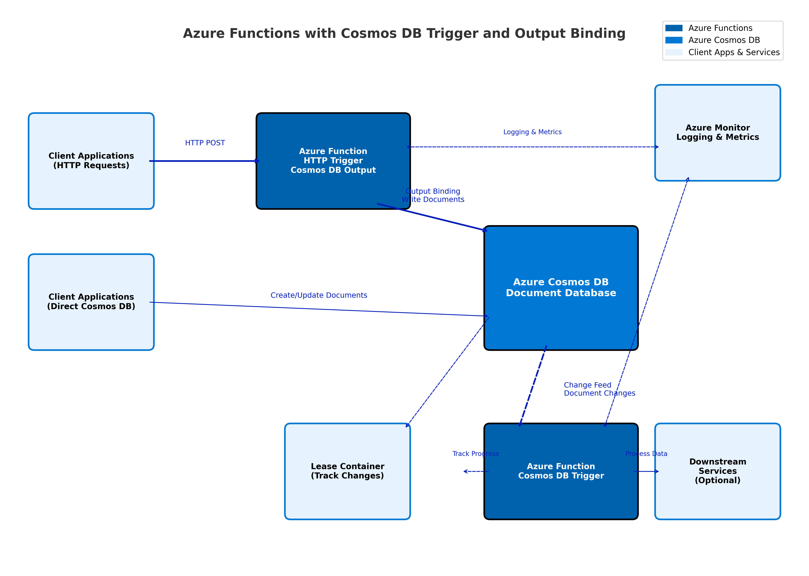

<!--
---
name: Azure Functions Python CosmosDb Trigger using Azure Developer CLI
description: This repository contains an Azure Functions CosmosDb trigger quickstart written in Python and deployed to Azure Functions Flex Consumption using the Azure Developer CLI (azd). The sample uses managed identity and a virtual network to make sure deployment is secure by default.
page_type: sample
products:
- azure-functions
- azure-cosmos-db
- azure
- entra-id
urlFragment: starter-cosmosdb-trigger-python
languages:
- python
- bicep
- azdeveloper
---
-->

# Azure Functions with Cosmos DB Trigger (Python)

An Azure Functions QuickStart project that runs two triggers over the same Cosmos DB container. `cosmos_trigger` retains the existing latest-version behavior, while `cosmos_full_fidelity_trigger` processes every create, replace, and delete operation by using All Versions and Deletes mode.

> **Looking for another language?** This quickstart is also available in
> [C# (.NET)](https://github.com/Azure-Samples/functions-quickstart-dotnet-azd-cosmosdb) |
> [Java](https://github.com/Azure-Samples/functions-quickstart-java-azd-cosmosdb) |
> [JavaScript](https://github.com/Azure-Samples/functions-quickstart-javascript-azd-cosmosdb) |
> [TypeScript](https://github.com/Azure-Samples/functions-quickstart-typescript-azd-cosmosdb) |
> [PowerShell](https://github.com/Azure-Samples/functions-quickstart-powershell-azd-cosmosdb)

## Architecture



This architecture shows how Azure Functions are triggered automatically when documents are created, modified, or deleted in Cosmos DB through the change feed mechanism. The key components include:

- **Client Applications**: Create, replace, or delete documents in Cosmos DB
- **Azure Cosmos DB**: Stores documents and provides change feed capabilities
- **Change Feed**: Provides latest-version and All Versions and Deletes modes
- **Azure Functions with Cosmos DB Triggers**: Compare the two modes over the same source container
- **Lease Container**: Tracks which changes have been processed to ensure reliability and support for multiple function instances
- **Azure Monitor**: Provides logging and metrics for the function execution
- **Downstream Services**: Optional integration with other services that receive processed data

This serverless architecture enables highly scalable, event-driven processing with built-in resiliency.

## Top Use Cases

1. **Real-time Data Processing Pipeline**: Automatically process data as it's created or modified in your Cosmos DB. Perfect for scenarios where you need to enrich documents, update analytics, or trigger notifications when new data arrives without polling.
2. **Event-Driven Microservices**: Build event-driven architectures where changes to your Cosmos DB documents automatically trigger downstream business logic. Ideal for order processing systems, inventory management, or content moderation workflows.

## Features

- Existing Cosmos DB latest-version trigger
- Separate All Versions and Deletes trigger
- Independent lease prefixes so both triggers process the same writes
- Create, replace, delete, and TTL-delete operation metadata
- Continuous backup with seven-day change retention
- Azure Functions Flex Consumption plan
- Azure Developer CLI (azd) integration for easy deployment
- Infrastructure as Code using Bicep templates
- Python 3.14 support

## Getting Started

### Prerequisites

- [A supported Python version](https://learn.microsoft.com/azure/azure-functions/supported-languages?pivots=programming-language-python#languages-by-runtime-version) compatible with the latest `azure-functions` package
- [Azure Functions Core Tools](https://docs.microsoft.com/azure/azure-functions/functions-run-local#install-the-azure-functions-core-tools)
- [Azure Developer CLI (azd)](https://docs.microsoft.com/azure/developer/azure-developer-cli/install-azd)
- [Azure CLI](https://learn.microsoft.com/cli/azure/install-azure-cli) authenticated with `az login`
- [Azurite](https://github.com/Azure/Azurite)
- An Azure subscription

> [!IMPORTANT]
> The Cosmos DB Emulator doesn't support All Versions and Deletes mode. The functions run locally but must connect to an Azure Cosmos DB for NoSQL account with continuous backup and All Versions and Deletes enabled. Azurite is used only for Functions host storage.

### Quickstart

1. Clone this repository

   ```bash
   git clone https://github.com/Azure-Samples/functions-quickstart-python-azd-cosmosdb.git
   cd functions-quickstart-python-azd-cosmosdb
   ```

2. Make scripts executable (Mac/Linux):

   ```bash
   chmod +x ./infra/scripts/*.sh
   ```

   On Windows:

   ```powershell
   set-executionpolicy remotesigned
   ```

3. Provision Azure resources using azd

   ```bash
   azd provision
   ```

   This will create all necessary Azure resources including:

   - Azure Cosmos DB for NoSQL account with continuous seven-day backup
   - Azure Function App
   - App Service Plan
   - Other supporting resources
   - The All Versions and Deletes account feature, enabled by the post-provision hook
   - `local.settings.json` for local development with Azure Functions Core Tools, which should look like this:

   ```json
   {
     "IsEncrypted": false,
     "Values": {
       "AzureWebJobsStorage": "UseDevelopmentStorage=true",
       "FUNCTIONS_WORKER_RUNTIME": "python",
       "COSMOS_CONNECTION__accountEndpoint": "https://{accountName}.documents.azure.com:443/",
       "COSMOS_DATABASE_NAME": "documents-db",
       "COSMOS_CONTAINER_NAME": "documents"
     }
   }
   ```

   The `azd` command automatically sets up the identity-based connection and application settings. Enabling All Versions and Deletes can take up to 30 minutes.

   To run locally against an existing Cosmos DB account instead, copy the settings template and replace its placeholder values. The signed-in identity must have a Cosmos DB data-plane role on the account.

   ```bash
   cp local.settings.json.template local.settings.json
   ```

   On Windows:

   ```powershell
   Copy-Item local.settings.json.template local.settings.json
   ```

4. Create and activate a Python virtual environment:

   ```bash
   python -m venv .venv
   source .venv/bin/activate  # On Windows use: .venv\Scripts\activate
   ```

5. Install Python dependencies:

   ```bash
   pip install -r requirements.txt
   ```

   Run the zero-cloud metadata and handler tests:

   ```bash
   python -m unittest discover -s tests -v
   ```

6. Start Azurite, then start the functions locally in a separate terminal. Start the functions before changing documents because All Versions and Deletes mode starts from the current time.

   ```bash
   azurite --silent
   ```

   ```bash
   func start
   ```

   Or use VS Code to run the project with the built-in Azure Functions extension by pressing F5.

7. In the Azure portal, open the provisioned Cosmos DB account, select **Data Explorer**, and create an item in the configured database and container:

   ```json
   {
     "id": "python-change-feed-test",
     "status": "created",
     "sequence": 1
   }
   ```

   On create, both triggers run:

   ```text
   Documents modified: 1
   First document id: python-change-feed-test
   FullFidelity change index=0 operation=create id=python-change-feed-test
   ```

   Replace `status` with `"updated"` and `sequence` with `2`, then save the item. Both triggers run again, with the full-fidelity trigger reporting `operation=replace`.

   Delete the item. Only `cosmos_full_fidelity_trigger` receives the delete:

   ```text
   FullFidelity change index=0 operation=delete id=python-change-feed-test
   ```

   Wait for both invocations before performing the next operation. Their order in the terminal can vary.

8. Deploy to Azure

   ```bash
   azd up
   ```

   This will build your function app and deploy it to Azure. The deployment process:

   - Checks for any bicep changes using `azd provision`
   - Packages the Python project
   - Publishes the function app using `azd deploy`
   - Updates application settings in Azure

   > **Note:** If you deploy with `vnetEnabled=true`, see the [Networking and VNet Integration](#networking-and-vnet-integration) section below for important details about accessing Cosmos DB and Data Explorer from your developer machine.

9. Test the deployed function by adding another document to your Cosmos DB container through the Azure Portal:

   - Navigate to your Cosmos DB account in the Azure Portal
   - Go to Data Explorer
   - Find your database and container
   - Create a new document with similar structure to the test document above
   - Check your function logs in the Azure Portal to verify the trigger worked

## Understanding the Function

Both functions monitor the configured container. The key environment variables that configure them are:

- `COSMOS_CONNECTION__accountEndpoint`: The Cosmos DB account endpoint
- `COSMOS_DATABASE_NAME`: The name of the database to monitor
- `COSMOS_CONTAINER_NAME`: The name of the container to monitor

These are automatically set up by azd during deployment for both local and cloud environments.

### Core Python Implementations

- `cosmos_trigger` uses `CosmosDBChangeFeedMode.LATEST_VERSION` and receives plain documents for creates and replaces.
- `cosmos_full_fidelity_trigger` uses `CosmosDBChangeFeedMode.ALL_VERSIONS_AND_DELETES` and receives change envelopes with operation metadata and delete events.

Both functions use the pre-provisioned `leases` container with different `lease_container_prefix` values, allowing them to process the same source container independently. All Versions and Deletes mode can start from now or an existing lease checkpoint; it doesn't support starting from the beginning or from a specified time.

## Monitoring and Logs

You can monitor your function in the Azure Portal:

1. Navigate to your function app in the Azure Portal
2. Select "Functions" from the left menu
3. Click on `cosmos_trigger` or `cosmos_full_fidelity_trigger`
4. Select "Monitor" to view execution logs

Use the "Live Metrics" feature to see real-time information when testing.

## Networking and VNet Integration

If you deploy with `vnetEnabled=true`, all access to Cosmos DB is restricted to the private endpoint and the connected virtual network. This enhances security by blocking public access to your database.

**Important:** When `vnetEnabled=true`, it is a requirement to add your developer machine's public IP address to the Cosmos DB account's networking firewall allow list. *The deployment scripts included in this template run as a part of `azd provision` and handle this for you*. Alternatively it can be done in the Azure Portal or Azure CLI.

## Resources

- [Azure Functions Documentation](https://docs.microsoft.com/azure/azure-functions/)
- [Cosmos DB Documentation](https://docs.microsoft.com/azure/cosmos-db/)
- [Cosmos DB Change Feed Modes](https://learn.microsoft.com/azure/cosmos-db/nosql/change-feed-modes)
- [Azure Developer CLI Documentation](https://docs.microsoft.com/azure/developer/azure-developer-cli/)
